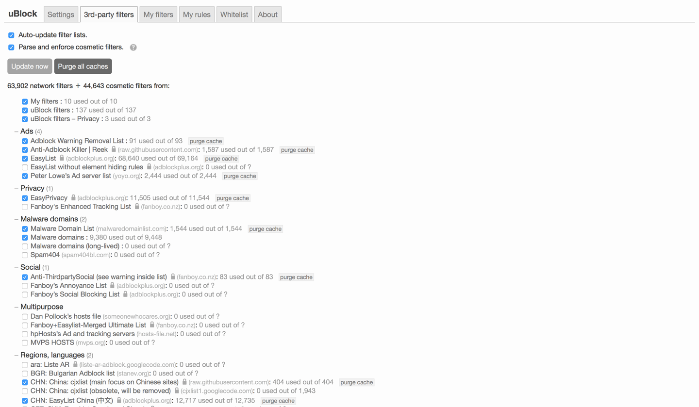

# fuckbaidu

## Descripton

这是一个用于去除百度推广的自定义规则，因为adblock,adblock plus,uBlock的默认中文规则都无法很好的解决百度推广的问题。

## How TO

### 1.Install uBlock

#### Chromium

You can install the latest version [manually](https://github.com/gorhill/uBlock/tree/master/dist#install), from the [Chrome Store](https://chrome.google.com/webstore/detail/ublock-origin/cjpalhdlnbpafiamejdnhcphjbkeiagm), or from the [Opera store](https://addons.opera.com/en-gb/extensions/details/ublock/) (uBlock Origin is published under the name "µBlock" in the Opera store -- the name can't be changed).

It is expected that uBlock Origin is compatible with any Chromium-based browsers.

#### Safari

You can install the latest version [manually](https://github.com/gorhill/uBlock/tree/master/dist#install), from the [uBlock Official](https://www.ublock.org)

#### Firefox / Firefox for Android

[Firefox Add-ons web site](https://addons.mozilla.org/addon/ublock-origin/). There is also a development version if you want to test uBlock Origin with the latest changes: see [_uBlock Origin Version History_](https://addons.mozilla.org/addon/ublock-origin/versions/beta)

uBlock Origin is compatible with [SeaMonkey](http://www.seamonkey-project.org/), [Pale Moon](https://www.palemoon.org/), and possibly other browsers based on Firefox.

The Firefox version of uBlock Origin has [an extra feature](https://github.com/gorhill/uBlock/wiki/Inline-script-tag-filtering) currently not yet available on Chromium-based browsers -- which feature is of great help to foil attempts by many web sites to circumvent blockers.

Also of interest: [Deploying uBlock Origin for Firefox with CCK2 and Group Policy](http://decentsecurity.com/ublock-for-firefox-deployment/).

##### Debian/Ubuntu

Users of Debian 9 or later or Ubuntu 16.04 or later may simply

`apt-get install xul-ext-ublock-origin`.

### 2.Subscribe Filters

### 3.Import My Filters

Go to uBlock settings,choose My filters,then import my filters.

## License

[GPLv3](https://github.com/gorhill/uBlock/blob/master/LICENSE.txt).